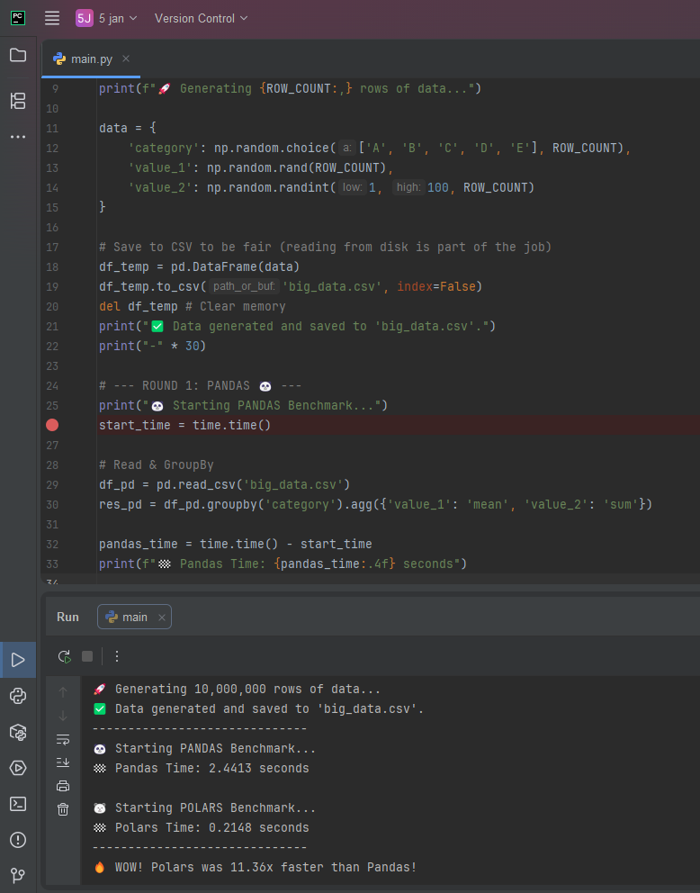

# 🚀 Pandas vs. Polars: The Ultimate Speed Benchmark


A high-performance comparison between **Pandas** (the industry standard) and **Polars** (the rust-based lightning-fast alternative) processing **10 Million Rows** of data.

---

## 📸 Benchmark Proof


---

## 📊 Results at a Glance

| Library | Processing Time (sec) | Speedup | Performance Verdict |
| :--- | :--- | :--- | :--- |
| **Pandas** 🐼 | 2.4413s | 1x | Baseline |
| **Polars** 🐻‍❄️ | **0.2148s** | **11.36x 🚀** | **Superior** |

> *Note: Benchmark executed on a local machine generating 10,000,000 rows.*

## 💡 Business Value (Why Switch?)
In Data Science, optimization isn't just about code—it's about **ROI**.
Migrating legacy pipelines from Pandas to Polars offers:
1.  **💰 Reduced Cloud Costs:** Lower CPU time directly translates to lower AWS/Azure bills.
2.  **⏱️ Faster Time-to-Insight:** Deliver dashboards to stakeholders 11x faster.
3.  **📉 Memory Efficiency:** Handle larger datasets without crashing servers.

## 🛠️ How to Replicate
1. **Clone this repository:**
   ```bash
   git clone [https://github.com/behnamjb222-cmd/Pandas-vs-Polars-Benchmark.git](https://github.com/behnamjb222-cmd/Pandas-vs-Polars-Benchmark.git)
   cd Pandas-vs-Polars-Benchmark
